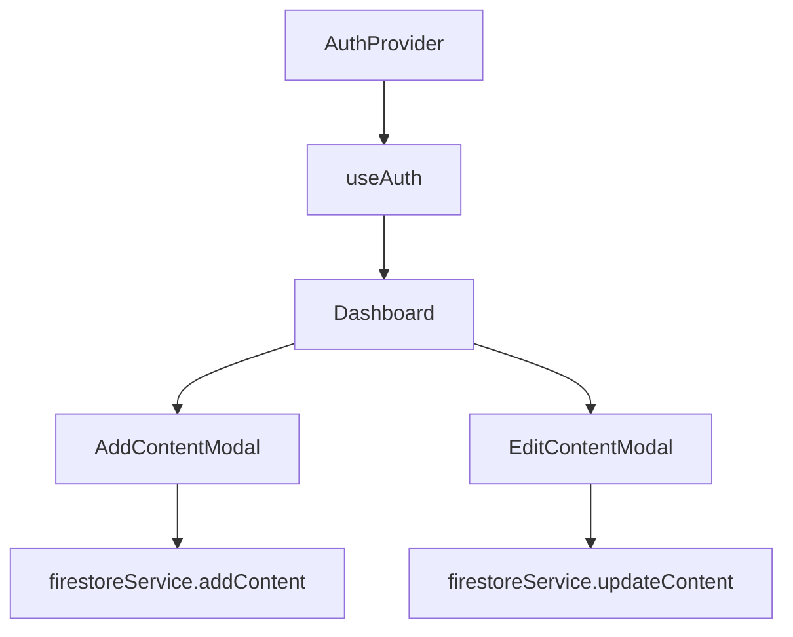

# Traylist – Unified Reading & Watchlist Extension

Traylist is a React + Firebase-powered web application designed to help users organize, track, and manage their learning and media content efficiently. It supports various types of content including articles, books, videos, and shows with metadata, progress tracking, and filtering capabilities.

---

## Features

- Firebase authentication (email/password)
- Responsive, accessible UI built with TailwindCSS
- Content types: article, book, video, show
- Track status: to-do, in-progress, completed
- Progress tracking with visual updates
- Search and tag filtering
- Add, edit, and delete content entries
- Real-time Firestore integration
- Conditional metadata fields based on content type

---

## Project Structure

```

├── App.tsx
├── components/
│   ├── Dashboard.tsx
│   ├── AddContentModal.tsx
│   └── EditContentModal.tsx
├── contexts/
│   └── AuthContext.tsx
├── lib/
│   ├── firebase.ts
│   └── firestore.ts
├── types/
│   └── index.ts
└── index.ts

````

---

## Application Flow

```mermaid
flowchart TD
  App --> AuthProvider
  AuthProvider --> AuthContext
  AuthContext --> AppContent
  AppContent -->|if authenticated| Dashboard
  AppContent -->|if not| Login
  Dashboard --> FirestoreService
  Dashboard --> AddContentModal
  Dashboard --> EditContentModal
````

---

## Authentication Logic

```mermaid

graph TD
  FirebaseAuth --> onAuthStateChanged
  onAuthStateChanged --> setCurrentUser
  LoginForm --> login
  SignupForm --> signup
  AuthContext --> AppContent

```

---

## Component Communication Overview



---

## Content Schema

| Field    | Type      | Description                          |
| -------- | --------- | ------------------------------------ |
| title    | string    | Content title                        |
| type     | string    | One of: article, book, video, show   |
| status   | string    | One of: todo, in-progress, completed |
| progress | number    | Completion progress (0–100)          |
| tags     | string\[] | Comma-separated tags                 |
| author   | string    | Author (for books)                   |
| duration | string    | Duration (for videos)                |
| readTime | string    | Read time estimate (for articles)    |
| episodes | string    | Episodes completed (for shows)       |
| url      | string    | Optional link                        |
| notes    | string    | Optional personal notes              |

---

## Setup Instructions

### 1. Clone Repository

```bash
git clone https://github.com/officiallyutso/reading-watchlist-extension.git
cd reading-watchlist-extension
npm install
```

### 2. Firebase Setup

* Go to [Firebase Console](https://console.firebase.google.com/)
* Create a new project
* Enable **Authentication** (Email/Password)
* Enable **Firestore Database**
* Replace `lib/firebase.ts` with your Firebase config:

```ts
import { initializeApp } from "firebase/app";
import { getAuth } from "firebase/auth";
import { getFirestore } from "firebase/firestore";

const firebaseConfig = {
  apiKey: "YOUR_API_KEY",
  authDomain: "your-app.firebaseapp.com",
  projectId: "your-app-id",
  ...
};

const app = initializeApp(firebaseConfig);
export const auth = getAuth(app);
export const db = getFirestore(app);
```

### 3. Development

```bash
npm run dev
```

---

## License

This project is licensed under the MIT License.

---

## Author

Developed and maintained by [utsosarkar](https://github.com/officiallyutso).

